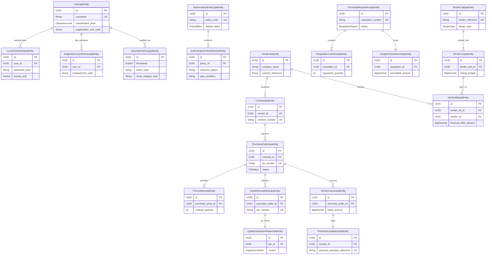
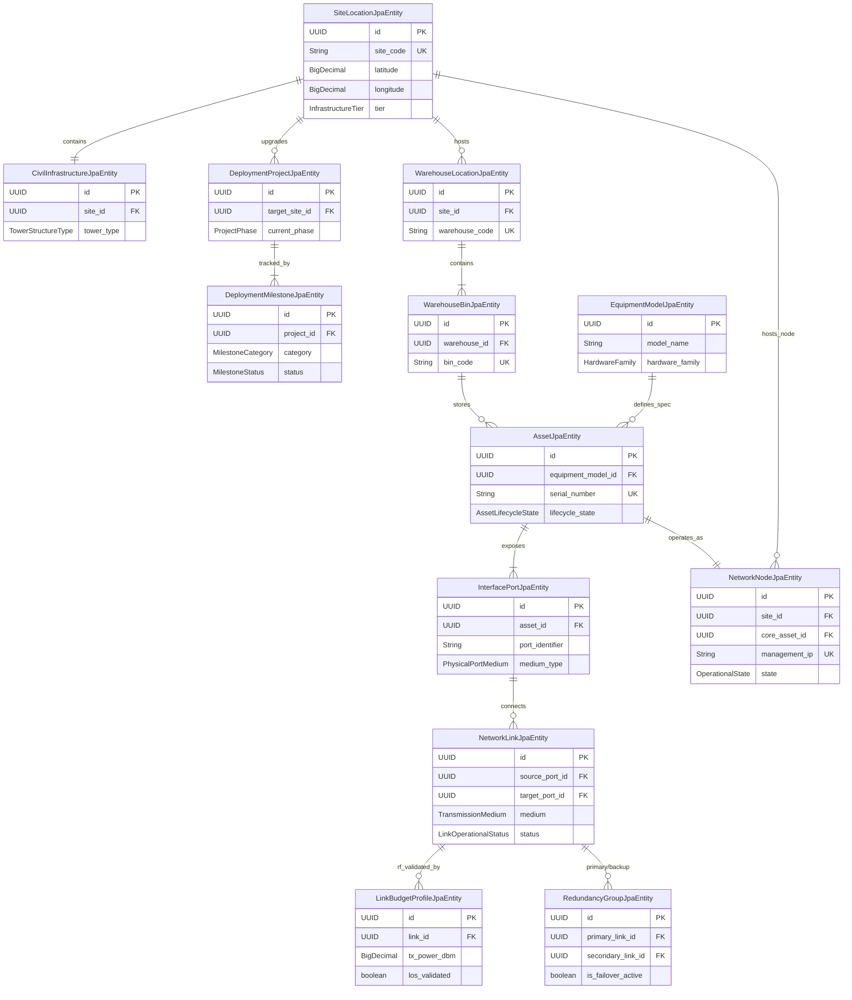
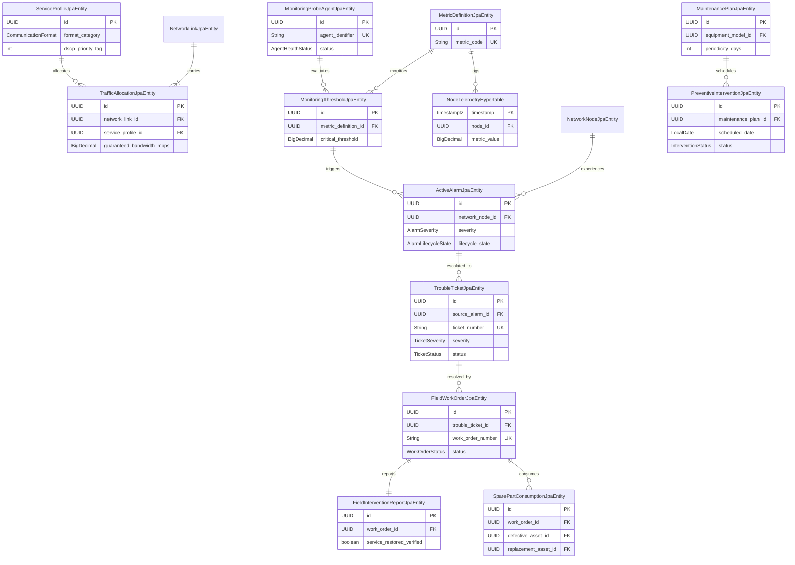
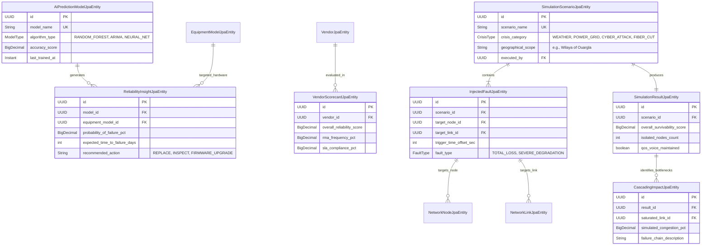

# SigPulse: Signals Planning and Monitoring System

**Project Foundation & Architectural Conception Document**

## 1. Executive Summary

### 1.1 Vision

SigPulse is the unified operational command center for the organization's entire communications and signal infrastructure across Algerian territory. The vision is to eliminate operational silos by bridging financial acquisition, physical infrastructure deployment, active network telemetry, field maintenance, and **AI-driven strategic foresight** into a single, continuous, and highly secure lifecycle management platform. By leveraging a dynamic **Digital Twin**, the system transitions operations from reactive troubleshooting to proactive crisis management and predictive resilience.

### 1.2 Goal

To deploy an enterprise-grade, Domain-Driven Design (DDD) platform that enables the organization to proactively plan geographical network expansions, strictly govern the procurement of hardware, enforce multi-level security, actively monitor multi-format traffic (voice, video, data) in real-time, simulate catastrophic failures, and utilize artificial intelligence to drive strategic decision-making.

### 1.3 Core Objectives

1. **End-to-End Traceability:** Track every hardware component from the initial planning requisition, through formal tendering and procurement, to physical installation and eventual decommissioning.
2. **Geographical & Mathematical Validation:** Mandate that every new edge site expansion connects to the main backbone with a mathematically validated Radio Frequency (RF) link budget and Line-of-Sight (LoS) clearance before hardware is purchased.
3. **Zero-Trust Role Segregation:** Enforce strict operational boundaries between the Planning, Procurement, Maintenance, and Command units.
4. **Resilient Telemetry:** Isolate high-frequency network monitoring from the relational inventory database to ensure system stability during massive network events.
5. **Automated Incident Resolution:** Instantly cross-reference real-time telemetry drops with the static infrastructure topology to pinpoint root causes and execute redundant link failovers automatically.
6. **Data-Driven Decision Making (AI):** Utilize machine learning models on historical telemetry and maintenance data to predict hardware failures, recommend vendor reliability, and optimize QoS routing.
7. **Proactive Crisis Simulation:** Maintain a live "Digital Twin" of the infrastructure, allowing architects to inject synthetic faults (e.g., severe weather dropping regional links) to validate failover survivability before a real crisis occurs.

---

## 2. Functional Conception

The system is organized into eight interconnected operational pillars:

### 2.1 Topography & Deployment Planning

* **GIS Terrain Integration:** Planners use map interfaces to plot new edge sites across wilayas, defining structural tower and power requirements.
* **Link Budget & Capacity:** Calculates transmission power, receiver sensitivity, and free-space path loss to validate link viability.
* **Backbone Hierarchy:** Enforces rules ensuring every new `EDGE_SITE` logically and physically connects back to a `REGIONAL_DISTRIBUTION` or `BACKBONE_CORE` node.

### 2.2 End-to-End Procurement

* **Automated BOM:** Validated site plans generate a Bill of Materials.
* **Statutory Workflows:** Manages purchase requisitions, budget commitments, tender bidding, contract awards, and formal Purchase Orders.
* **Warehouse Receiving:** Enforces Quality Assurance (QA) inspections before procured items enter active stock inventory.

### 2.3 CMDB & Dynamic Inventory

* **Physical Asset Tracking:** Manages serial numbers, MAC addresses, and modular parent-child hardware chassis.
* **Configuration Baselines:** Stores cryptographic hashes of authorized hardware configurations to prevent unauthorized tampering.

### 2.4 Multi-Format Traffic & QoS

* **Traffic Segmentation:** Allocates logical bandwidth queues across physical links to separate `VOICE` (telephony), `VISIOPHONE` (video), and `CLASSIFIED_DATA`.
* **Prioritization:** Ensures massive data transfers cannot saturate the link and drop low-latency communication formats.

### 2.5 Continuous Telemetry & Failover

* **Non-Blocking Polling:** Executes thousands of concurrent health checks (uptime, latency, jitter, QoS queue saturation).
* **Redundancy Orchestration:** Pre-maps primary and backup links. Automatically reroutes backbone traffic upon detecting a primary path loss-of-signal.

### 2.6 ITSM & Maintenance

* **Automated Ticketing:** Converts sustained telemetry alarms into actionable Trouble Tickets.
* **Field Dispatch:** Issues Field Work Orders to technicians and logs spare part consumption.
* **Preventive Maintenance:** Schedules routine servicing (e.g., generator checks, tower inspections).

### 2.7 AI Analytics & Statistical Decision Support

* **Predictive Maintenance (Helper):** Analyzes historical hardware degradation (e.g., a specific optical switch model failing frequently at high temperatures) and flags deployed assets for replacement before they fail.
* **Vendor Reliability Scoring:** Aggregates procurement SLAs, QA inspection pass rates, and field RMA frequency to generate statistical rankings, assisting the Procurement Unit during tender evaluations.
* **Capacity Forecasting:** Uses machine learning on TimescaleDB metrics to forecast when specific regional backbone links will hit bandwidth saturation based on current expansion rates.

### 2.8 Infrastructure Simulator & Digital Twin

* **Synthetic Fault Injection:** Allows the Planning and Command units to simulate the loss of specific nodes, severed links, or widespread power grid failures (e.g., simulating a blackout in a specific wilaya).
* **Cascading Impact Analysis:** Calculates exactly how traffic will reroute during the simulated crisis, identifying "choke points" where backup links would be overwhelmed by the diverted traffic.
* **Redundancy Validation:** Mathematically proves that the `RedundancyGroup` definitions will actually keep `VOICE` and `VISIOPHONE` services online during a catastrophic Layer-1 failure.

---

## 3. Technical Architecture & Infrastructure

SigPulse relies on a highly scalable, hybrid-database architecture utilizing the Spring Boot ecosystem for enterprise reliability, integrated with specialized data science runtimes.

| Architectural Layer | Recommended Technology | Justification / Role |
| --- | --- | --- |
| **Client Presentation** | React JS (TypeScript) | Single Page Application (SPA) offering distinct unit-based workspaces. |
| **Visualizations** | React Flow & Mapbox | React Flow for logical topology mapping; Mapbox for GIS terrain deployment. |
| **Core API & Logic** | Spring Boot (Java) | Central DDD engine enforcing security, workflow state machines, and business rules. |
| **Telemetry Worker** | Spring WebFlux / Virtual Threads | Executes highly concurrent, non-blocking SNMP/ICMP network polling. |
| **Relational Hub** | PostgreSQL (Spring Data JPA) | Ensures strict ACID compliance and referential integrity for CMDB and Procurement. |
| **Monitoring Hub** | TimescaleDB | Time-series database specifically optimized for high-volume telemetry ingestion. |
| **AI & Simulation Engine** | Python (FastAPI, PyTorch/Scikit-Learn) | A dedicated microservice querying historical PostgreSQL/TimescaleDB data to execute graph-based crisis simulations and train predictive statistical models. |
| **Event Broker** | Apache Kafka | Consumes offline alerts and broadcasts failover commands, triggering both live re-routing and AI model retraining. |

---

## 4. Data Entity Schema

The persistence layer is modeled on a Domain-Driven Design (DDD) architecture, cleanly segregating the system into modular contexts.

### 4.1 Enterprise Administration & Acquisition Layer

Handles Identity, Security Clearances, and the Procurement lifecycle.

### 4.2 Physical & Logical Infrastructure Layer

Maps the CMDB hardware, geographical site deployments, RF frequency clearances, and logical network topologies.

### 4.3 Active Operations & ITSM Layer

Handles high-frequency telemetry (TimescaleDB), QoS enforcement, automatic anomaly alerting, and corrective field maintenance.

### 4.4 AI Analytics & Crisis Simulation Layer

Manages the Digital Twin topology states, synthetic fault injection scenarios, and predictive statistical models generated by the Python/AI microservice.

---

## 5. Core Operational Workflows

### A. Statutory Procurement to Ingestion Workflow

1. **Demand Generation:** A new transmission site project generates required `RequisitionLineItemJpaEntity` entries linked to a `PurchaseRequisitionJpaEntity`.
2. **AI Vendor Selection (Helper):** The Procurement Unit queries `VendorScorecardJpaEntity` to review historically reliable vendors before issuing the tender.
3. **Competitive Tendering:** A `TenderCallJpaEntity` is published; vendor proposals are evaluated and awarded.
4. **Contract Execution:** The `ContractJpaEntity` is finalized, establishing delivery dates.
5. **Delivery & QA:** Upon shipment arrival, warehouse personnel record a `GoodsReceiptNoteJpaEntity`. `QualityInspectionReportJpaEntity` confirms technical specs before items enter the active CMDB as `IN_STOCK`.

### B. Autonomous Telemetry & Failover Loop

1. **Telemetry Polling:** The polling engine streams metrics into `NodeTelemetryHypertable`.
2. **Anomaly Detection:** Metrics violating a `MonitoringThresholdJpaEntity` trigger an `ActiveAlarmJpaEntity`.
3. **Failover Execution:** The system automatically executes a switch to the secondary path via `RedundancyGroupJpaEntity`, logging the event.
4. **ITSM Escalation:** Sustained alarms convert into `TroubleTicketJpaEntity` for field dispatch.

### C. Proactive Crisis Simulation Workflow

1. **Scenario Definition:** The Command or Planning unit creates a `SimulationScenarioJpaEntity` to test a disaster (e.g., massive storm taking down three major nodes).
2. **Fault Injection:** The simulation engine clones the current network state from the CMDB and applies `InjectedFaultJpaEntity` triggers.
3. **Cascading Analysis:** The graph engine calculates rerouting logic, logging over-saturated backup paths into `CascadingImpactJpaEntity`.
4. **Architectural Adjustment:** Planners review the `SimulationResultJpaEntity` and upgrade bandwidth on identified bottleneck links in the real world to prevent future failure.

### D. AI-Driven Predictive Maintenance Workflow

1. **Continuous Learning:** The `AiPredictionModelJpaEntity` consumes live TimescaleDB telemetry, hardware age, and environmental factors.
2. **Insight Generation:** The model generates a `ReliabilityInsightJpaEntity` indicating that a specific node has an 85% probability of failure within 14 days due to degrading optical receiver sensitivity.
3. **Preventive Intervention:** The Maintenance Unit issues a preventive `FieldWorkOrderJpaEntity` to replace the optical module before the outage occurs, ensuring zero downtime.
